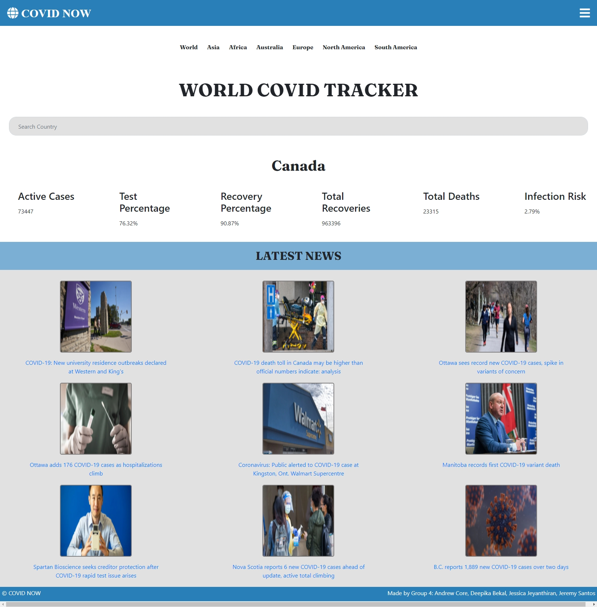

# Covid-Now

[](https://opensource.org/licenses/MIT)

## Description
Covid-Now is an application that provides Covid-19 information and latest Covid-19 news for the country that the user will enter in the Search box.

## Website
 https://deepikabekal.github.io/Covid-Now/

## Screenshot


## Technologies Used
* HTML
* CSS
* Javascript

## Libraries
* jQuery (https://jquery.com/)
* Font Awesome (https://fontawesome.com/)
* Google fonts (https://developers.google.com/fonts)

## APIs
* https://mediastack.com/
* 

## User Story
```
AS A consumer of news
I WANT A condensed report of the country of interest 
SO THAT I am informed of the global situation of the pandemic
```
## Acceptence Criteria
```
GIVEN A Covid-19 Dashboard with country search call to action
WHEN I search for a country
THEN I AM presented with the confirmed and recovered covid case count as well as covid related deaths for that region with the latest news reports
WHEN I click on the dropdown arrow in the search bar
THEN I AM presented with the country search history
WHEN I click on a country from the search history
THEN I AM again presented with the confirmed and recovered covid case count as well as covid related deaths for that region with the latest news reports
```

## References
* jQuery Documentation (https://api.jquery.com/)
* Stack overflow (https://stackoverflow.com/)
* MDN Web Docs (https://developer.mozilla.org/en-US/docs/Web/JavaScript)
